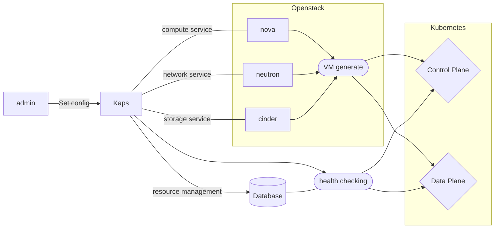

# KAPS.md

Kubernetes Auto Provisioning Service on Echo-e cloud system ( State of PoC )

This is the K8s [Cluster API](https://cluster-api.sigs.k8s.io/) or Openstack [Magnum](https://docs.openstack.org/magnum/latest/) like lightweight custom project that uses minimal processes.


# Progress


# Quick Start

1) Install [Golang](https://go.dev/) 1.20 

2) Clone repository

3) Run the Code
```bash
swag init && go run main.go
```

# Structure




```bash
.
├── README.md
├── docs
│   ├── docs.go
│   ├── swagger.json
│   └── swagger.yaml
├── go.mod
├── go.sum
├── k8s_provisioning
│   ├── common.sh
│   ├── k8s_control.sh
│   ├── k8s_control_join.sh
│   ├── k8s_data.sh
│   └── test.sh
├── kaas
│   └── kaas.go
├── main.go
├── nohup.out
├── openstack
│   ├── compute.go
│   ├── identity.go
│   ├── image.go
│   ├── network.go
│   └── token.go
├── routes
│   └── route.go
├── run.sh
├── types
│   └── type.go
└── utils
    ├── file.go
    └── rand.go
```

# Docs
TBU

# Contact

Email : syyang@forwiz.com
